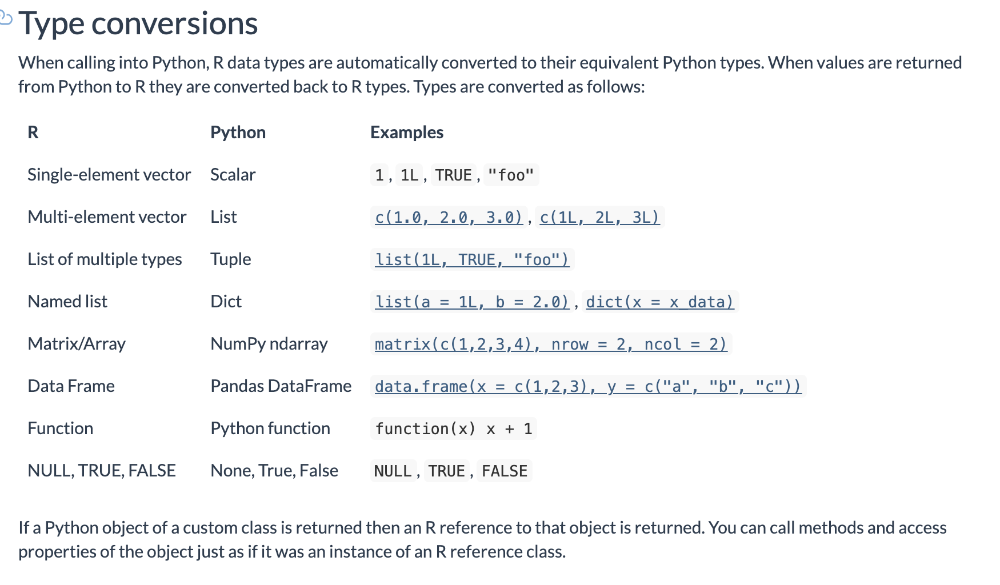

```{r setup, include=FALSE}
library(tidyverse)
options(htmltools.dir.version = FALSE)
knitr::opts_chunk$set(warning = FALSE, message = FALSE)
```

class: left, middle, r-logo

## Key resources

* [Github repo](https://github.com/keithmcnulty/r_and_py_models) containing everything you need for this talk

* [Details and tutorials](https://rstudio.github.io/reticulate/) on the `reticulate` package which is used to translate between R and Python 

---
class: left, middle, r-logo

## Python Environments

All Python projects need an environment where all supporting packages are installed.  Virtualenv and Conda are the two most common environment management tools.

For this project you'll need a Python environment with the following packages installed: `pandas`, `scipy`, `python-pptx`, `scikit-learn`, `xgboost`. 

Conda example terminal commands:

```
# create conda env and install packages
conda create --name r_and_py_models python=3.7
conda activate
conda install <list of packages>

# get environment path for use with reticulate
conda info 

```


---
class: left, middle, r-logo

## Why would someone even need to use two languages

* In general, each language has its strengths.  There are things its generally easier to do in Python (eg Machine Learning), and there are things that its easier to do in R (eg, inferential statistics, tidy data).

* You may want to work primarily in one language but need specific functionality that's more easily available in the other language.

* You may have been 'handed' code in Python by someone else but you need to get it working in R.

* You don't have the time or interest to recode into a single language.

---
class: left, middle, r-logo

## Setting up a project involving both R and Python

* Work in RStudio

* Use the `reticulate` package in R

* Point to a Python *executable* inside an environment with all the required packages by setting the `RETICULATE_PYTHON` environment variable in a `.Rprofile` file which executes at project startup.  Here is what mine looks like.

```{r, eval = FALSE, }
# Force the use of a specific python environment - note that path must be to the python executable
Sys.setenv(RETICULATE_PYTHON = "/Users/keithmcnulty/opt/anaconda3/envs/r_and_py_models/bin/python3")

# print a confirmation on project startup/R restart
print(paste("Python environment forced to", Sys.getenv("RETICULATE_PYTHON")))
```

---
class: left, middle, r-logo

## Ways to use Python in RStudio

1.  Write a `.py` script.  File > New File > Python Script

2.  Code directly in the Python interpreter to test code:  `reticulate::repl_python()`

3.  Write an R Markdown document with R code wrapped in `{r}` and Python code wrapped in `{python}`

---
class: left, middle, r-logo

## Exchanging objects between R and Python

Remember that you always need `reticulate` loaded:

```{r}
library(reticulate)
```

* The `reticulate` package makes it easy to access Python objects in R and vice versa.  

* If `my_python_object` is a Python object, it can be accessed in R using `py$my_python_object`.  

* If `my_r_object` is an R object, it can be accessed in Python using `r.my_r_object`.

---
class: left, middle, r-logo

## Let's create a couple of things in Python and use them in R

```{python}
## create a dict in Python
my_dict={'team_python': ['dale', 'brenden', 'matthieu'], 'team_r': ['liz', 'rachel', 'alex', 'jordan']}

## define a function in Python
def is_awesome(who: str) -> str:
  return '{x} is awesome!'.format(x=who) 
```

```{r}
my_list <- py$my_dict
str(my_list)
my_list$team_python

is_awesome <- py$is_awesome
is_awesome('R')

```

---
class: left, middle, r-logo

## Now let's do the opposite

```{r}
# a vector in R
my_vec <- c("data engineering", "data science")

# a function in R
unique_words <- function(string) {
  unique(unlist(strsplit(string, " ")))
}

```

```{python}
my_list=r.my_vec
my_list

unique_words=r.unique_words
unique_words(my_list)

```

---
class: left, middle, r-logo

## More details on type conversions

```{r, echo = FALSE}

```

---
class: left, middle, r-logo

## Example Scenario 1: Editing Powerpoint

You have a simple Powerpoint document in the `templates` folder of this project called `ppt-template.pptx`.  You want to automatically edit it by replacing some of the content with data from csv files for 20 different groups, creating 20 different Powerpoint documents - one for each group.

You have a function provided to you in Python which does this replacement.  It is in the file `edit_pres.py` in the `python` folder of this project.  However, you are not great with Python and you much prefer to manage data in R.

First, you source the Python function into your R session and take a look at the function, which is now automatically an R function:

```{r}
source_python("python/edit_pres.py")

edit_pres
```

---
class: left, middle, r-logo

## Example Scenario 1: Editing Powerpoint

The function takes five arguments, a target group name, a table of summary statistics for all groups, a specific data table for the target group, the name of the input file and the name of the output file.

Let's run the function for one group using some of the data in our `data` folder:

```{r}
# all summary stats
chart_df <- read.csv("data/chart_df.csv")

# Group A table
table_A <- read.csv("data/table_A.csv")

input <- "templates/ppt-template.pptx"
output <- "group_A.pptx"

edit_pres("A", chart_df, table_A, input, output)
```

---
class: left, middle, r-logo

## Example Scenario 1: Editing Powerpoint

Now we can get all of our data into a tidy dataframe:

```{r}
library(dplyr)

# load in data files
for (file in list.files("data")) {
  splits <- strsplit(file, "\\.")
  assign(splits[[1]][1],
         read.csv(paste0("data/", file)))
} 

# rowwise mutate a list column onto chart_df containing the table data for each group
full_data <- chart_df %>% 
  rowwise() %>% 
  dplyr::mutate(table = list(get(paste0("table_", group))))
```

---
class: left, middle, r-logo

## Example Scenario 1: Editing Powerpoint

Let's look at a few rows and columns:

```{r}
head(full_data) %>% 
  dplyr::select(group, cat1_1, cat1_2, table)
```

---
class: left, middle, r-logo

## Example Scenario 1: Editing Powerpoint

Now we can mutate our `edit_pres()` function to generate all the powerpoint in a single command.

```{r}
# rowwise mutate the edit_pres function to generate parametrized powerpoint
generate_ppt <- full_data %>% 
  rowwise() %>% 
  dplyr::mutate(
    ppt = edit_pres(group, ., table, "templates/ppt-template.pptx", 
                                paste0("report_group_", group, ".pptx"))
    )

# let's see what happened
head(generate_ppt) %>% 
  dplyr::select(group, ppt)
```

---
class: left, middle, r-logo

## Example Scenario 2: Running XGBoost in R

You've been asked to train a 10-fold cross-validated XGBoost model on a set of data about wines.  You want to see how accurately you can predict a high quality wine.

You have never run XGBoost before and you're not great with Python.

However, a colleague has given you a set of Python functions which they use for training XGBoost models.  These functions are in `python_functions.py`.  You source them into R.

```{r}
source_python("python_functions.py")
```

---
class: left, middle, r-logo

## Example Scenario 2: Running XGBoost in R

We create our data set by downloading the data, adding a binary 'red' wine feature and defining 'high quality' to be a quality score of 7 or more.

```{r}
white_wines <- read.csv("https://archive.ics.uci.edu/ml/machine-learning-databases/wine-quality/winequality-white.csv", sep = ";")
red_wines <- read.csv("https://archive.ics.uci.edu/ml/machine-learning-databases/wine-quality/winequality-red.csv", sep = ";")

white_wines$red <- 0
red_wines$red <- 1

wine_data <- white_wines %>% 
  bind_rows(red_wines) %>% 
  mutate(high_quality = ifelse(quality >= 7, 1, 0)) %>% 
  select(-quality)
```

---
class: left, middle, r-logo

## Example Scenario 2: Running XGBoost in R

If we look in the Python code, we can see that all our parameters are expected to be in a dict.  In R, this means they need to be in a named list, so let's create the list of parameters we will use:

```{r}
params <- list(
  input_cols = colnames(wine_data)[colnames(wine_data) != 'high_quality'],
  target_col = 'high_quality',
  test_size = 0.3,
  random_state = 123,
  subsample = (3:9)/10, 
  xgb_max_depth = 3:9,
  colsample_bytree = (3:9)/10,
  xgb_min_child_weight = 1:4,
  k = 10,
  k_shuffle = TRUE,
  n_iter = 10,
  scoring = 'f1',
  error_score = 0,
  verbose = 1,
  n_jobs = -1
)
```

---
class: left, middle, r-logo

## Example Scenario 2: Running XGBoost in R

Our first function `split_data()` expects a data frame input and will output a list of four data frames - two for training and two for testing.

```{r}
split <- split_data(wine_data, parameters = params)

# check we got what we wanted 
names(split)
```


---
class: left, middle, r-logo

## Example Scenario 2: Running XGBoost in R

Our next function `scale_data()` scales the features to prepare them for XGBoost.  It expects two feature dataframes for train and test and outputs a list of two scaled dataframes.

```{r}
scaled <- scale_data(split$X_train, split$X_test)

# check we got what we wanted 
names(scaled)
```


---
class: left, middle, r-logo

## Example Scenario 2: Running XGBoost in R

Next we train our XGBoost model with 10-fold cross-validation.  This function expects a scaled feature dataframe, a target dataframe and some parameters.

```{r}
# created trained model object
trained <- train_xgb_crossvalidated(
  scaled$X_train_scaled, 
  split$y_train, 
  parameters = params
)

# we can check that we can predict from the trained model
test_obs <- py_to_r(scaled$X_test_scaled)
trained$predict(test_obs[1:5, ])
```

---
class: left, middle, r-logo

## Example Scenario 2: Running XGBoost in R

Our last function generates a classification report - it expects a trained model, a set of test features and targets, and outputs a report dataframe:

```{r}
generate_classification_report(
  trained,
  scaled$X_test_scaled,
  split$y_test
)

```

---
class: left, middle, r-logo

## Deploying Shiny Apps that use R and Python together

* The server (eg ShinyServer or RStudioConnect) will need to have Python enabled and a Python version installed

* Your local Python version on which you built the app will need to be compatible with the one that's on the server - you can ensure this in you conda/virtualenv setup.

* If deploying from Github, when you run `rsconnect::writeManifest()` it will also create the `requirements.txt` file for your Python packages.  This should be pushed to Github along with `manifest.json`

* DO NOT push `.Rprofile` to Github.  This will cause deployment to fail.  For safety, add `.Rprofile` to `.gitignore` if you are intending to build a deployed app.